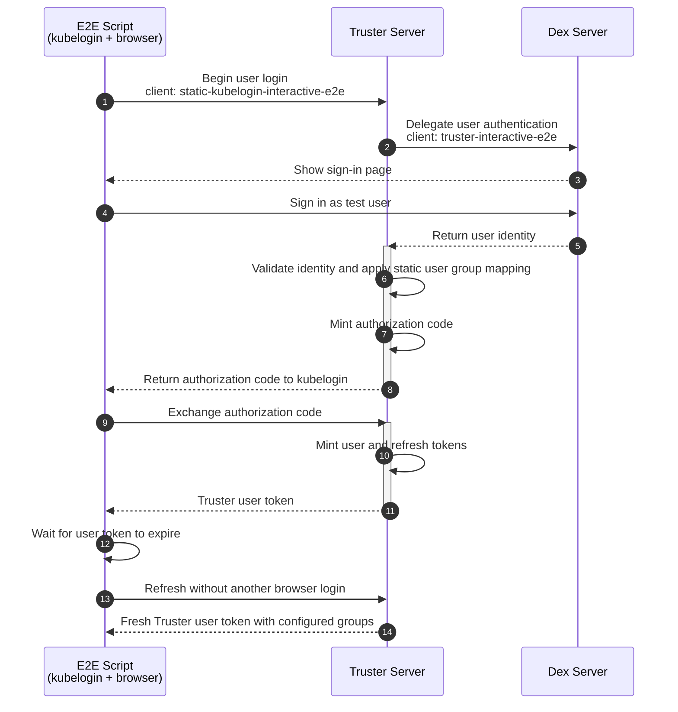
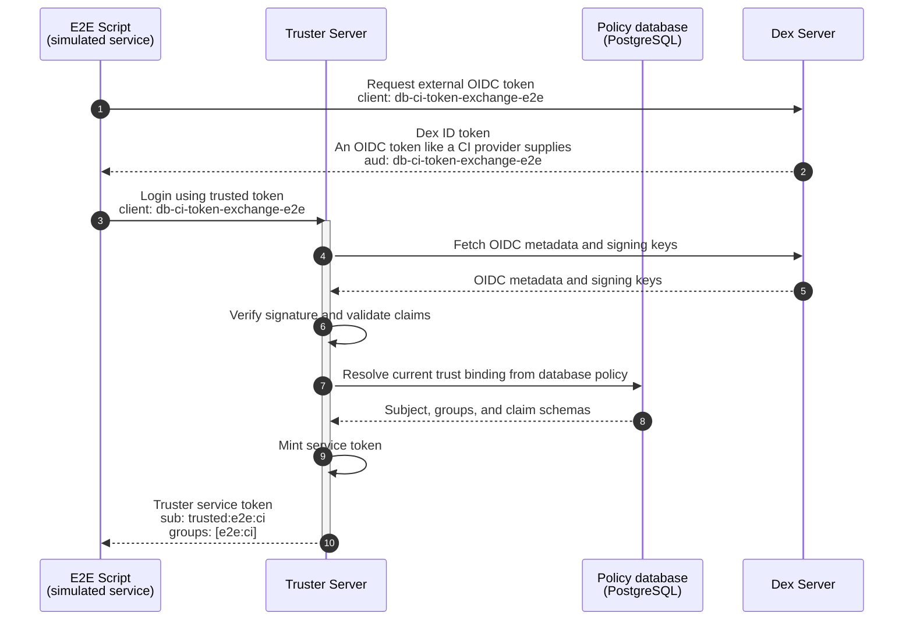
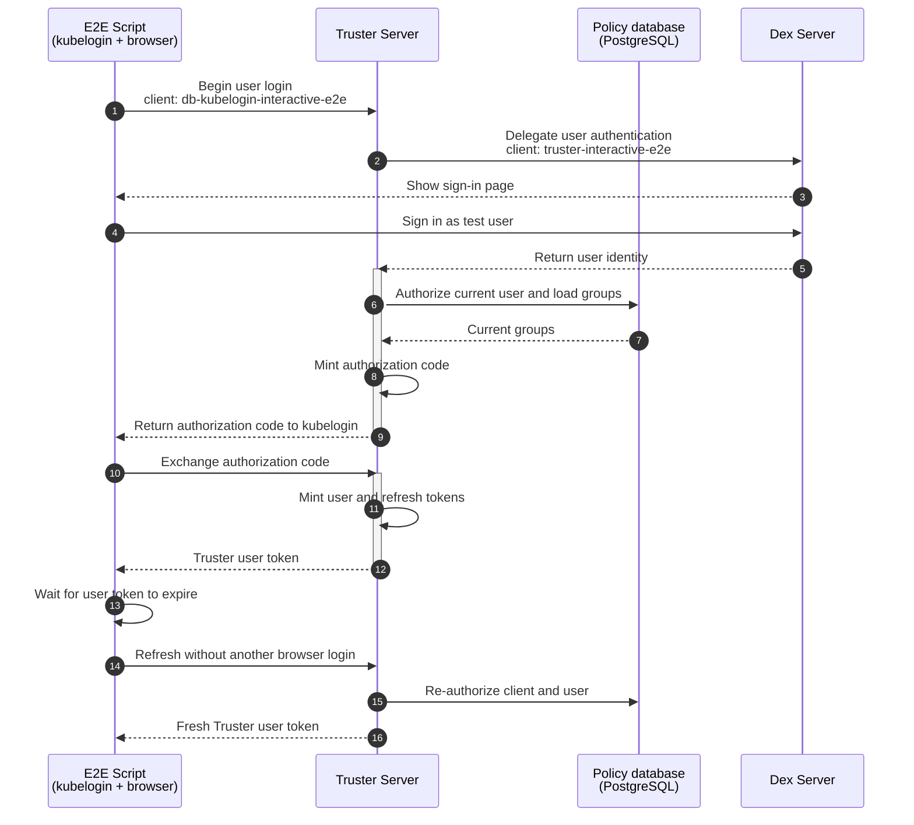

# End-to-end login flows

The E2E test runs a DPoP login followed by four bearer-token login flows against
one Dex server. The static flows run before their database policy equivalents.
Distinct client IDs ensure both policy sources are exercised in the same
Truster replica pair.

PostgreSQL supplies both read-only policy and authoritative protocol state. Two
Truster replicas share it and all secrets behind a local round-robin proxy, so
the complete login and refresh flows naturally cross replicas. The script
restarts both replicas before refresh, rejects any SQLite `.db` file, then stops
PostgreSQL to verify fail-closed readiness and protocol behavior before proving
both running replicas recover when PostgreSQL returns.

The test opens Dex interactively in a terminal and runs its mock connector
headlessly under CI or other non-interactive runners. Set `E2E_HEADLESS=true` or
`E2E_HEADLESS=false` to override detection.

Install the external clients with `brew install oauth2c kubelogin` before
running `make e2e`. The suite is pinned to a `oauth2c` version; CI downloads that
release directly.

## DPoP Login with PAR

The Go-based `oauth2c` client independently discovers Truster, pushes an
authorization request with PAR, completes an authorization-code flow with PKCE,
exchanges the code using DPoP, and refreshes with the same key. A small helper
built on `go-dpop` then checks token binding, UserInfo access, cross-replica
replay rejection, bearer downgrade rejection, revocation, and post-revocation
failure. Its separate Go module keeps E2E-only dependencies out of the server.

## Trusted Service Login

## User Interactive Login

The server log is checked after these flows to prove neither static client
caused a policy database query.

## Trusted Service Login from Database Policy

## User Interactive Login from Database Policy

