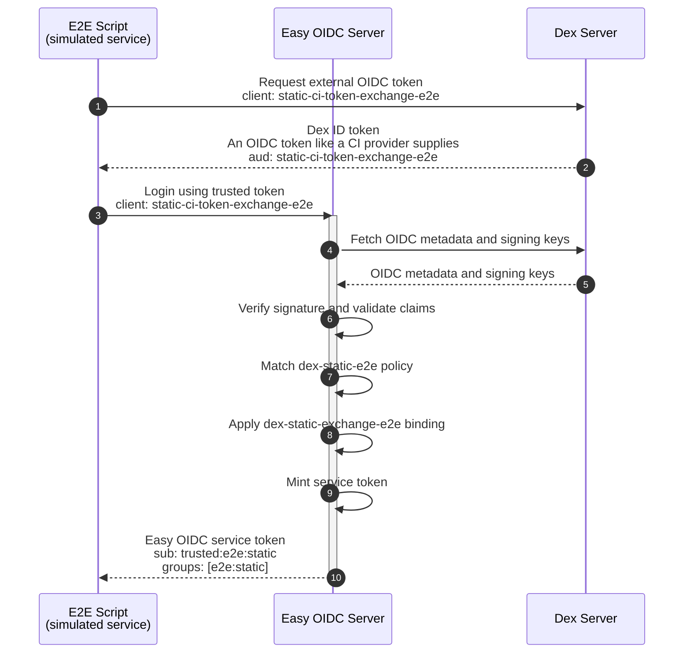
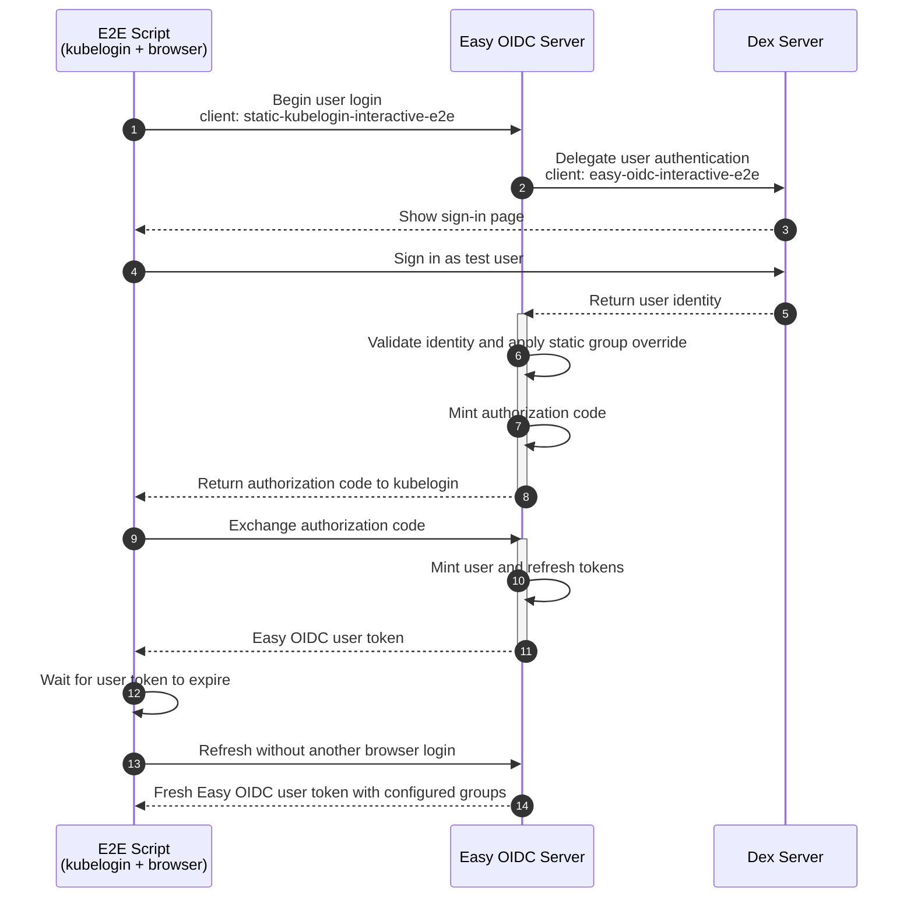
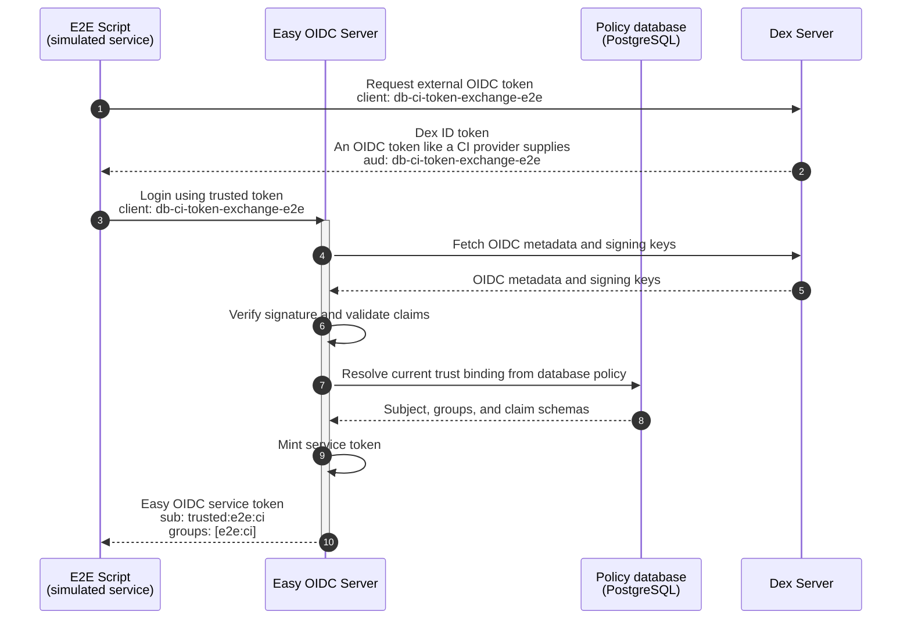
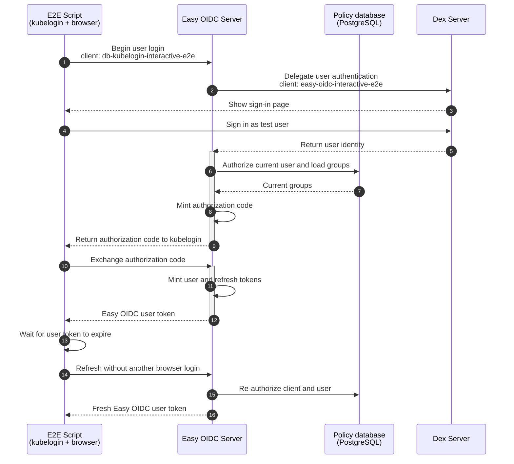

# End-to-end login flows

The E2E test runs four login flows against one Dex server, in this order. The
static flows run first, followed by their database policy equivalents. Distinct
client IDs ensure both policy sources are exercised in the same Easy OIDC
process.

## Trusted Service Login

## User Interactive Login

The server log is checked after these flows to prove neither static client
caused a policy database query.

## Trusted Service Login from Database Policy

## User Interactive Login from Database Policy

