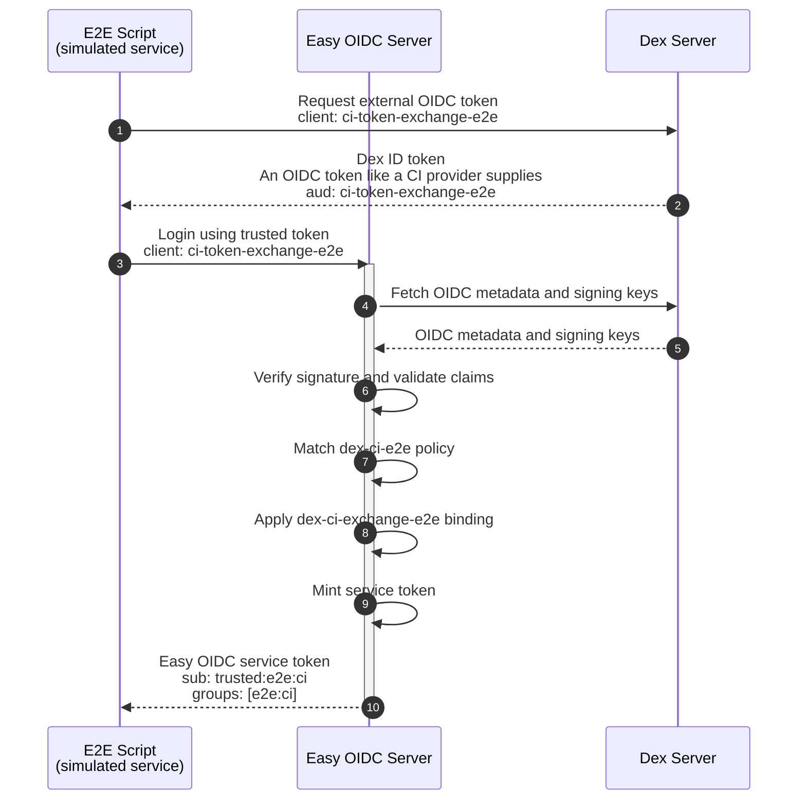
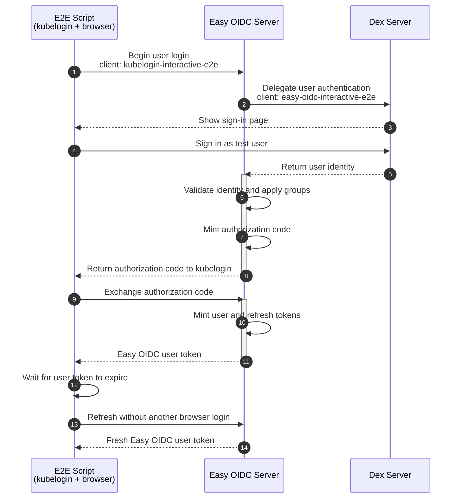

# End-to-end login flows

The E2E test runs two distinct login flows against one Dex server, in this
order.

## Trusted Service Login

```mermaid
sequenceDiagram
    autonumber
    participant Script as E2E Script<br/>(simulated service)
    participant Easy as Easy OIDC Server
    participant Dex as Dex Server

    Script->>Dex: Request external OIDC token<br/>client: ci-token-exchange-e2e
    Dex-->>Script: Dex ID token<br/>An OIDC token like a CI provider supplies<br/>aud: ci-token-exchange-e2e
    Script->>Easy: Login using trusted token<br/>client: ci-token-exchange-e2e
    activate Easy
    Easy->>Dex: Fetch OIDC metadata and signing keys
    Dex-->>Easy: OIDC metadata and signing keys
    Easy->>Easy: Verify signature and validate claims
    Easy->>Easy: Match dex-ci-e2e policy
    Easy->>Easy: Apply dex-ci-exchange-e2e binding
    Easy->>Easy: Mint service token
    Easy-->>Script: Easy OIDC service token<br/>sub: trusted:e2e:ci<br/>groups: [e2e:ci]
    deactivate Easy
```

## User Interactive Login

```mermaid
sequenceDiagram
    autonumber
    participant Script as E2E Script<br/>(kubelogin + browser)
    participant Easy as Easy OIDC Server
    participant Dex as Dex Server

    Script->>Easy: Begin user login<br/>client: kubelogin-interactive-e2e
    Easy->>Dex: Delegate user authentication<br/>client: easy-oidc-interactive-e2e
    Dex-->>Script: Show sign-in page
    Script->>Dex: Sign in as test user
    Dex-->>Easy: Return user identity
    activate Easy
    Easy->>Easy: Validate identity and apply groups
    Easy->>Easy: Mint authorization code
    Easy-->>Script: Return authorization code to kubelogin
    deactivate Easy
    Script->>Easy: Exchange authorization code
    activate Easy
    Easy->>Easy: Mint user and refresh tokens
    Easy-->>Script: Easy OIDC user token
    deactivate Easy
    Script->>Script: Wait for user token to expire
    Script->>Easy: Refresh without another browser login
    Easy-->>Script: Fresh Easy OIDC user token
```
